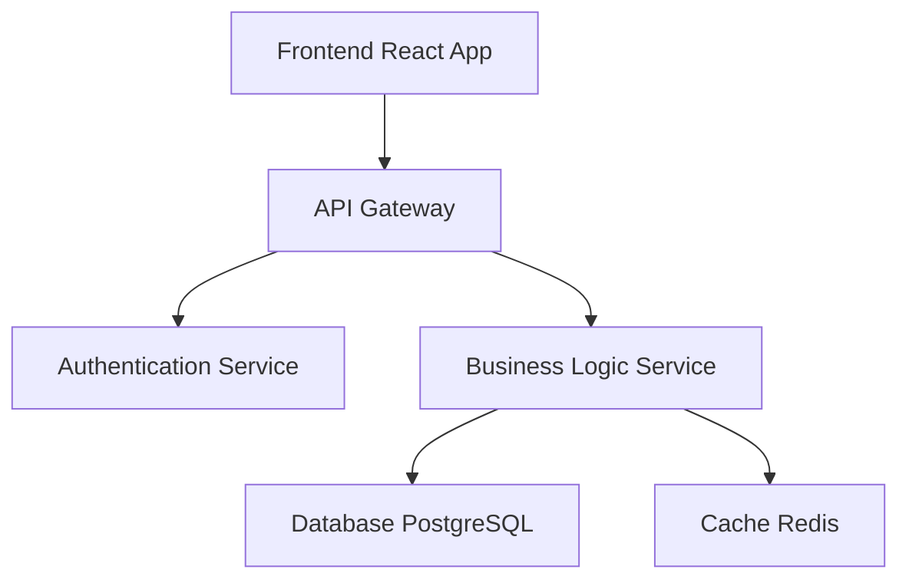

# Application One - Development Guide

Welcome to the development documentation for Application One. This guide covers everything you need to know to develop, build, and maintain Application One.

## Overview

Application One is a modern web application built with cutting-edge technologies. It provides a robust platform for managing business processes and data workflows.

## Architecture

### Technology Stack
- **Frontend**: React 18 with TypeScript
- **Backend**: Node.js with Express
- **Database**: PostgreSQL 15
- **Caching**: Redis
- **Authentication**: JWT with OAuth 2.0

### System Components



## Development Environment Setup

### Prerequisites

Before you begin, ensure you have the following installed:

- Node.js 18+ and npm
- PostgreSQL 15+
- Redis 6+
- Git
- Docker (optional, for containerized development)

### Local Setup

1. **Clone the repository**
   ```bash
   git clone https://github.com/hallcrest/application-one.git
   cd application-one
   ```

2. **Install dependencies**
   ```bash
   npm install
   ```

3. **Environment configuration**
   ```bash
   cp .env.example .env
   # Edit .env with your local settings
   ```

4. **Database setup**
   ```bash
   npm run db:migrate
   npm run db:seed
   ```

5. **Start development server**
   ```bash
   npm run dev
   ```

## API Documentation

### Authentication Endpoints

#### POST /api/auth/login
Authenticate user and return JWT token.

**Request Body:**
```json
{
  "email": "user@example.com",
  "password": "securepassword"
}
```

**Response:**
```json
{
  "token": "eyJhbGciOiJIUzI1NiIsInR5cCI6IkpXVCJ9...",
  "user": {
    "id": 1,
    "email": "user@example.com",
    "name": "John Doe"
  }
}
```

### Data Management Endpoints

#### GET /api/data
Retrieve paginated data with filtering options.

**Query Parameters:**
- `page` (number): Page number (default: 1)
- `limit` (number): Items per page (default: 20)
- `filter` (string): Filter criteria
- `sort` (string): Sort field and direction

**Example:**
```bash
GET /api/data?page=1&limit=10&filter=active&sort=created_at:desc
```

## Testing

### Unit Tests
```bash
npm run test
```

### Integration Tests
```bash
npm run test:integration
```

### End-to-End Tests
```bash
npm run test:e2e
```

## Code Standards

### TypeScript Guidelines
- Use strict TypeScript configuration
- Define interfaces for all data structures
- Use proper type annotations
- Avoid `any` type usage

### React Guidelines
- Use functional components with hooks
- Implement proper error boundaries
- Follow accessibility (a11y) best practices
- Use React.memo for performance optimization

### Code Quality
- ESLint configuration enforced
- Prettier for code formatting
- Husky pre-commit hooks
- SonarQube for code analysis

## Database Schema

### Users Table
```sql
CREATE TABLE users (
  id SERIAL PRIMARY KEY,
  email VARCHAR(255) UNIQUE NOT NULL,
  password_hash VARCHAR(255) NOT NULL,
  name VARCHAR(255) NOT NULL,
  created_at TIMESTAMP DEFAULT NOW(),
  updated_at TIMESTAMP DEFAULT NOW()
);
```

### Data Records Table
```sql
CREATE TABLE data_records (
  id SERIAL PRIMARY KEY,
  user_id INTEGER REFERENCES users(id),
  title VARCHAR(255) NOT NULL,
  content JSONB,
  status VARCHAR(50) DEFAULT 'active',
  created_at TIMESTAMP DEFAULT NOW(),
  updated_at TIMESTAMP DEFAULT NOW()
);
```

## Performance Considerations

### Optimization Strategies
- Implement database query optimization
- Use Redis caching for frequently accessed data
- Lazy loading for React components
- CDN for static assets
- Database connection pooling

### Monitoring
- Application performance monitoring (APM)
- Error tracking and reporting
- Database query performance analysis
- User experience metrics

## Security Guidelines

### Authentication & Authorization
- JWT tokens with appropriate expiration
- Role-based access control (RBAC)
- API rate limiting
- Input validation and sanitization

### Data Protection
- Encrypt sensitive data at rest
- Use HTTPS for all communications
- Implement CORS policies
- Regular security audits

## Deployment

### Build Process
```bash
npm run build
npm run test:ci
npm run security:audit
```

### Production Deployment
- Docker containerization
- Kubernetes orchestration
- Blue-green deployment strategy
- Automated rollback capabilities

## Troubleshooting

### Common Issues

#### Database Connection Errors
Check database configuration and ensure PostgreSQL is running:
```bash
sudo systemctl status postgresql
```

#### Memory Issues
Monitor application memory usage and adjust Node.js heap size:
```bash
node --max-old-space-size=4096 app.js
```

#### Performance Problems
Use profiling tools to identify bottlenecks:
```bash
npm run profile
```

## Contributing

1. Fork the repository
2. Create a feature branch
3. Make your changes
4. Add tests for new functionality
5. Ensure all tests pass
6. Submit a pull request

For detailed contribution guidelines, see [CONTRIBUTING.md](./CONTRIBUTING.md).

## Support

For development support, contact the development team:
- Email: dev-team@hallcrest.engineering
- Slack: #application-one-dev
- Documentation: https://docs.hallcrest.engineering