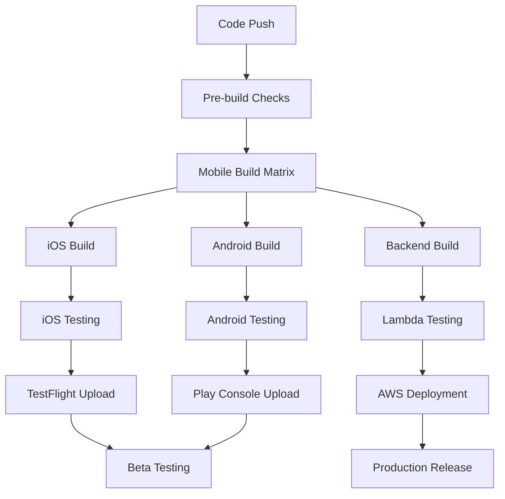

# Application Three - Automation Guide

This guide covers comprehensive automation for Application Three's mobile-first architecture, including mobile app CI/CD, serverless backend deployment, app store distribution, and cloud infrastructure management.

## Mobile CI/CD Pipeline Overview

Application Three uses a sophisticated multi-platform CI/CD pipeline that handles React Native builds for both iOS and Android, serverless backend deployment, and automated app store distribution.

### Pipeline Architecture



## GitHub Actions Workflows

### Main Mobile CI/CD Pipeline

Located at `.github/workflows/mobile-ci-cd.yml`:

```yaml
name: Mobile CI/CD Pipeline

on:
  push:
    branches: [main, develop]
  pull_request:
    branches: [main]

env:
  NODE_VERSION: '18'
  RUBY_VERSION: '3.0'
  JAVA_VERSION: '17'

jobs:
  pre-checks:
    runs-on: ubuntu-latest
    outputs:
      mobile-changed: ${{ steps.changes.outputs.mobile }}
      backend-changed: ${{ steps.changes.outputs.backend }}
    steps:
      - uses: actions/checkout@v4
      
      - uses: dorny/paths-filter@v2
        id: changes
        with:
          filters: |
            mobile:
              - 'src/**'
              - 'android/**'
              - 'ios/**'
              - 'package.json'
            backend:
              - 'backend/**'
              - 'backend/template.yaml'

  lint-and-test:
    runs-on: ubuntu-latest
    needs: pre-checks
    if: needs.pre-checks.outputs.mobile-changed == 'true'
    
    steps:
      - uses: actions/checkout@v4
      
      - name: Setup Node.js
        uses: actions/setup-node@v4
        with:
          node-version: ${{ env.NODE_VERSION }}
          cache: 'npm'
      
      - name: Install dependencies
        run: npm install
      
      - name: Run ESLint
        run: npm run lint
      
      - name: Run TypeScript check
        run: npm run type-check
      
      - name: Run unit tests
        run: npm test -- --coverage --watchAll=false
      
      - name: Upload coverage to Codecov
        uses: codecov/codecov-action@v3
        with:
          file: ./coverage/coverage-final.json

  build-ios:
    runs-on: macos-13
    needs: [pre-checks, lint-and-test]
    if: needs.pre-checks.outputs.mobile-changed == 'true'
    
    steps:
      - uses: actions/checkout@v4
      
      - name: Setup Node.js
        uses: actions/setup-node@v4
        with:
          node-version: ${{ env.NODE_VERSION }}
          cache: 'npm'
      
      - name: Setup Ruby
        uses: ruby/setup-ruby@v1
        with:
          ruby-version: ${{ env.RUBY_VERSION }}
          bundler-cache: true
      
      - name: Install dependencies
        run: |
          npm install
          cd ios && bundle install && pod install
      
      - name: Setup Xcode
        uses: maxim-lobanov/setup-xcode@v1
        with:
          xcode-version: '15.0'
      
      - name: Import Code-Signing Certificates
        uses: Apple-Actions/import-codesign-certs@v2
        with:
          p12-file-base64: ${{ secrets.IOS_P12_BASE64 }}
          p12-password: ${{ secrets.IOS_P12_PASSWORD }}
      
      - name: Download Provisioning Profiles
        uses: Apple-Actions/download-provisioning-profiles@v2
        with:
          bundle-id: com.hallcrest.applicationthree
          issuer-id: ${{ secrets.APPSTORE_ISSUER_ID }}
          api-key-id: ${{ secrets.APPSTORE_KEY_ID }}
          api-private-key: ${{ secrets.APPSTORE_PRIVATE_KEY }}
      
      - name: Build iOS app
        run: |
          npx react-native run-ios --configuration Release --simulator "iPhone 14"
      
      - name: Run iOS tests
        run: |
          cd ios
          xcodebuild test -workspace ApplicationThree.xcworkspace \
                         -scheme ApplicationThree \
                         -destination 'platform=iOS Simulator,name=iPhone 14'
      
      - name: Build for TestFlight (Release only)
        if: github.ref == 'refs/heads/main'
        run: |
          cd ios
          bundle exec fastlane beta
        env:
          FASTLANE_APPLE_APPLICATION_SPECIFIC_PASSWORD: ${{ secrets.FASTLANE_APPLE_APPLICATION_SPECIFIC_PASSWORD }}
          FASTLANE_SESSION: ${{ secrets.FASTLANE_SESSION }}

  build-android:
    runs-on: ubuntu-latest
    needs: [pre-checks, lint-and-test]
    if: needs.pre-checks.outputs.mobile-changed == 'true'
    
    steps:
      - uses: actions/checkout@v4
      
      - name: Setup Node.js
        uses: actions/setup-node@v4
        with:
          node-version: ${{ env.NODE_VERSION }}
          cache: 'npm'
      
      - name: Setup Java
        uses: actions/setup-java@v4
        with:
          java-version: ${{ env.JAVA_VERSION }}
          distribution: 'temurin'
      
      - name: Setup Android SDK
        uses: android-actions/setup-android@v3
      
      - name: Install dependencies
        run: npm install
      
      - name: Cache Gradle packages
        uses: actions/cache@v3
        with:
          path: |
            ~/.gradle/caches
            ~/.gradle/wrapper
          key: ${{ runner.os }}-gradle-${{ hashFiles('**/*.gradle*', '**/gradle-wrapper.properties') }}
          restore-keys: |
            ${{ runner.os }}-gradle-
      
      - name: Make gradlew executable
        run: chmod +x android/gradlew
      
      - name: Build Android app
        run: |
          cd android
          ./gradlew assembleDebug
      
      - name: Run Android tests
        run: |
          cd android
          ./gradlew test
      
      - name: Build for Play Store (Release only)
        if: github.ref == 'refs/heads/main'
        run: |
          cd android
          echo "${{ secrets.ANDROID_KEYSTORE_BASE64 }}" | base64 -d > app/release.keystore
          ./gradlew bundleRelease
        env:
          ANDROID_KEYSTORE_PASSWORD: ${{ secrets.ANDROID_KEYSTORE_PASSWORD }}
          ANDROID_KEY_ALIAS: ${{ secrets.ANDROID_KEY_ALIAS }}
          ANDROID_KEY_PASSWORD: ${{ secrets.ANDROID_KEY_PASSWORD }}
      
      - name: Upload to Play Console
        if: github.ref == 'refs/heads/main'
        uses: r0adkll/upload-google-play@v1
        with:
          serviceAccountJsonPlainText: ${{ secrets.GOOGLE_PLAY_SERVICE_ACCOUNT_JSON }}
          packageName: com.hallcrest.applicationthree
          releaseFiles: android/app/build/outputs/bundle/release/*.aab
          track: internal

  build-backend:
    runs-on: ubuntu-latest
    needs: pre-checks
    if: needs.pre-checks.outputs.backend-changed == 'true'
    
    steps:
      - uses: actions/checkout@v4
      
      - name: Setup Node.js
        uses: actions/setup-node@v4
        with:
          node-version: ${{ env.NODE_VERSION }}
          cache: 'npm'
          cache-dependency-path: backend/package-lock.json
      
      - name: Setup AWS SAM CLI
        uses: aws-actions/setup-sam@v2
      
      - name: Configure AWS credentials
        uses: aws-actions/configure-aws-credentials@v2
        with:
          aws-access-key-id: ${{ secrets.AWS_ACCESS_KEY_ID }}
          aws-secret-access-key: ${{ secrets.AWS_SECRET_ACCESS_KEY }}
          aws-region: us-east-1
      
      - name: Install backend dependencies
        run: |
          cd backend
          npm install
      
      - name: Run backend tests
        run: |
          cd backend
          npm test
      
      - name: Build SAM application
        run: |
          cd backend
          sam build
      
      - name: Deploy to staging
        if: github.ref == 'refs/heads/develop'
        run: |
          cd backend
          sam deploy --config-env staging --no-confirm-changeset --no-fail-on-empty-changeset
      
      - name: Run integration tests
        if: github.ref == 'refs/heads/develop'
        run: |
          cd backend
          npm run test:integration
        env:
          API_BASE_URL: ${{ steps.deploy.outputs.api-url }}
      
      - name: Deploy to production
        if: github.ref == 'refs/heads/main'
        run: |
          cd backend
          sam deploy --config-env production --no-confirm-changeset --no-fail-on-empty-changeset

  e2e-tests:
    runs-on: macos-13
    needs: [build-ios, build-android, build-backend]
    if: github.ref == 'refs/heads/develop'
    
    steps:
      - uses: actions/checkout@v4
      
      - name: Setup Node.js
        uses: actions/setup-node@v4
        with:
          node-version: ${{ env.NODE_VERSION }}
          cache: 'npm'
      
      - name: Install dependencies
        run: |
          npm install
          npx detox clean-framework-cache && npx detox build-framework-cache
      
      - name: Build Detox
        run: npx detox build --configuration ios.sim.release
      
      - name: Run Detox tests
        run: npx detox test --configuration ios.sim.release --cleanup
```

### Fastlane Configuration

#### iOS Fastlane Configuration

```ruby
# ios/fastlane/Fastfile
default_platform(:ios)

platform :ios do
  before_all do
    setup_circle_ci
  end

  desc "Push a new beta build to TestFlight"
  lane :beta do
    increment_build_number(xcodeproj: "ApplicationThree.xcodeproj")
    
    build_app(
      workspace: "ApplicationThree.xcworkspace",
      scheme: "ApplicationThree",
      configuration: "Release",
      export_method: "app-store",
      output_directory: "./build"
    )
    
    upload_to_testflight(
      skip_waiting_for_build_processing: true,
      skip_submission: true,
      distribute_external: false,
      notify_external_testers: false
    )
    
    # Send Slack notification
    slack(
      message: "New iOS beta build uploaded to TestFlight! 🚀",
      channel: "#mobile-releases",
      webhook_url: ENV["SLACK_WEBHOOK_URL"]
    )
  end

  desc "Deploy a new version to the App Store"
  lane :release do
    increment_version_number(
      version_number: ENV["VERSION_NUMBER"]
    )
    
    increment_build_number(xcodeproj: "ApplicationThree.xcodeproj")
    
    build_app(
      workspace: "ApplicationThree.xcworkspace",
      scheme: "ApplicationThree",
      configuration: "Release",
      export_method: "app-store"
    )
    
    upload_to_app_store(
      submit_for_review: false,
      automatic_release: false,
      force: true
    )
    
    slack(
      message: "New iOS version submitted to App Store! 🎉",
      channel: "#mobile-releases",
      webhook_url: ENV["SLACK_WEBHOOK_URL"]
    )
  end

  desc "Run tests"
  lane :test do
    run_tests(
      workspace: "ApplicationThree.xcworkspace",
      scheme: "ApplicationThree",
      device: "iPhone 14",
      clean: true
    )
  end

  error do |lane, exception|
    slack(
      message: "iOS build failed: #{exception.message}",
      channel: "#mobile-alerts",
      webhook_url: ENV["SLACK_WEBHOOK_URL"],
      success: false
    )
  end
end
```

#### Android Fastlane Configuration

```ruby
# android/fastlane/Fastfile
default_platform(:android)

platform :android do
  desc "Deploy a new version to the Google Play"
  lane :deploy do
    gradle(
      task: "bundle",
      build_type: "Release",
      properties: {
        "android.injected.signing.store.file" => ENV["ANDROID_KEYSTORE_PATH"],
        "android.injected.signing.store.password" => ENV["ANDROID_KEYSTORE_PASSWORD"],
        "android.injected.signing.key.alias" => ENV["ANDROID_KEY_ALIAS"],
        "android.injected.signing.key.password" => ENV["ANDROID_KEY_PASSWORD"]
      }
    )
    
    upload_to_play_store(
      track: "internal",
      release_status: "draft",
      aab: "app/build/outputs/bundle/release/app-release.aab"
    )
    
    slack(
      message: "New Android build uploaded to Play Console! 🤖",
      channel: "#mobile-releases",
      webhook_url: ENV["SLACK_WEBHOOK_URL"]
    )
  end

  desc "Deploy to beta track"
  lane :beta do
    gradle(task: "bundle", build_type: "Release")
    
    upload_to_play_store(
      track: "beta",
      aab: "app/build/outputs/bundle/release/app-release.aab"
    )
  end

  desc "Promote from beta to production"
  lane :promote_to_production do
    upload_to_play_store(
      track: "beta",
      track_promote_to: "production",
      skip_upload_apk: true,
      skip_upload_aab: true
    )
  end

  desc "Run tests"
  lane :test do
    gradle(task: "test")
  end

  error do |lane, exception|
    slack(
      message: "Android build failed: #{exception.message}",
      channel: "#mobile-alerts",
      webhook_url: ENV["SLACK_WEBHOOK_URL"],
      success: false
    )
  end
end
```

## Backend Automation with AWS SAM

### SAM Configuration File

```toml
# backend/samconfig.toml
version = 0.1

[default]
[default.global]
[default.global.parameters]
stack_name = "application-three"
region = "us-east-1"
confirm_changeset = true
capabilities = "CAPABILITY_IAM"
disable_rollback = true
image_repositories = []

[default.build]
[default.build.parameters]
cached = true
parallel = true

[default.deploy]
[default.deploy.parameters]
capabilities = "CAPABILITY_IAM"
confirm_changeset = true
resolve_s3 = true
s3_prefix = "application-three"
region = "us-east-1"
image_repositories = []

[staging]
[staging.global]
[staging.global.parameters]
stack_name = "application-three-staging"
region = "us-east-1"

[staging.deploy]
[staging.deploy.parameters]
stack_name = "application-three-staging"
resolve_s3 = true
s3_prefix = "application-three-staging"
region = "us-east-1"
parameter_overrides = "Environment=staging"

[production]
[production.global]
[production.global.parameters]
stack_name = "application-three-production"
region = "us-east-1"

[production.deploy]
[production.deploy.parameters]
stack_name = "application-three-production"
resolve_s3 = true
s3_prefix = "application-three-production"
region = "us-east-1"
parameter_overrides = "Environment=production"
```

### Infrastructure as Code with CDK

```typescript
// infrastructure/lib/application-three-stack.ts
import * as cdk from 'aws-cdk-lib';
import * as lambda from 'aws-cdk-lib/aws-lambda';
import * as apigateway from 'aws-cdk-lib/aws-apigateway';
import * as dynamodb from 'aws-cdk-lib/aws-dynamodb';
import * as cognito from 'aws-cdk-lib/aws-cognito';
import * as s3 from 'aws-cdk-lib/aws-s3';
import * as cloudfront from 'aws-cdk-lib/aws-cloudfront';
import { Construct } from 'constructs';

export class ApplicationThreeStack extends cdk.Stack {
  constructor(scope: Construct, id: string, props?: cdk.StackProps) {
    super(scope, id, props);

    const environment = this.node.tryGetContext('environment') || 'dev';

    // DynamoDB Tables
    const usersTable = new dynamodb.Table(this, 'UsersTable', {
      tableName: `${id}-users-${environment}`,
      partitionKey: { name: 'userId', type: dynamodb.AttributeType.STRING },
      billingMode: dynamodb.BillingMode.PAY_PER_REQUEST,
      encryption: dynamodb.TableEncryption.AWS_MANAGED,
      pointInTimeRecovery: environment === 'production',
      removalPolicy: environment === 'production' 
        ? cdk.RemovalPolicy.RETAIN 
        : cdk.RemovalPolicy.DESTROY,
    });

    // S3 Bucket for file storage
    const filesBucket = new s3.Bucket(this, 'FilesBucket', {
      bucketName: `${id}-files-${environment}`,
      encryption: s3.BucketEncryption.S3_MANAGED,
      blockPublicAccess: s3.BlockPublicAccess.BLOCK_ALL,
      removalPolicy: environment === 'production' 
        ? cdk.RemovalPolicy.RETAIN 
        : cdk.RemovalPolicy.DESTROY,
      cors: [{
        allowedMethods: [s3.HttpMethods.GET, s3.HttpMethods.POST, s3.HttpMethods.PUT],
        allowedOrigins: ['*'],
        allowedHeaders: ['*'],
      }],
    });

    // CloudFront distribution for file delivery
    const distribution = new cloudfront.CloudFrontWebDistribution(this, 'FilesDistribution', {
      originConfigs: [{
        s3OriginSource: {
          s3BucketSource: filesBucket,
        },
        behaviors: [{
          isDefaultBehavior: true,
          allowedMethods: cloudfront.CloudFrontAllowedMethods.ALL,
          cachedMethods: cloudfront.CloudFrontAllowedCachedMethods.GET_HEAD_OPTIONS,
        }],
      }],
    });

    // Cognito User Pool
    const userPool = new cognito.UserPool(this, 'UserPool', {
      userPoolName: `${id}-users-${environment}`,
      selfSignUpEnabled: true,
      signInAliases: { email: true },
      autoVerify: { email: true },
      passwordPolicy: {
        minLength: 8,
        requireLowercase: true,
        requireUppercase: true,
        requireDigits: true,
      },
      accountRecovery: cognito.AccountRecovery.EMAIL_ONLY,
    });

    const userPoolClient = new cognito.UserPoolClient(this, 'UserPoolClient', {
      userPool,
      authFlows: {
        userPassword: true,
        userSrp: true,
      },
      generateSecret: false,
    });

    // Lambda Functions
    const userFunction = new lambda.Function(this, 'UserFunction', {
      runtime: lambda.Runtime.NODEJS_18_X,
      handler: 'user.handler',
      code: lambda.Code.fromAsset('dist/functions'),
      environment: {
        USERS_TABLE: usersTable.tableName,
        FILES_BUCKET: filesBucket.bucketName,
        USER_POOL_ID: userPool.userPoolId,
        REGION: this.region,
      },
      timeout: cdk.Duration.seconds(30),
    });

    // Grant permissions
    usersTable.grantReadWriteData(userFunction);
    filesBucket.grantReadWrite(userFunction);

    // API Gateway
    const api = new apigateway.RestApi(this, 'Api', {
      restApiName: `${id}-api-${environment}`,
      description: 'Application Three API',
      defaultCorsPreflightOptions: {
        allowOrigins: apigateway.Cors.ALL_ORIGINS,
        allowMethods: apigateway.Cors.ALL_METHODS,
      },
    });

    const userResource = api.root.addResource('users');
    userResource.addMethod('GET', new apigateway.LambdaIntegration(userFunction));
    userResource.addMethod('POST', new apigateway.LambdaIntegration(userFunction));

    const userIdResource = userResource.addResource('{id}');
    userIdResource.addMethod('GET', new apigateway.LambdaIntegration(userFunction));
    userIdResource.addMethod('PUT', new apigateway.LambdaIntegration(userFunction));

    // Outputs
    new cdk.CfnOutput(this, 'ApiUrl', {
      value: api.url,
      description: 'API Gateway URL',
      exportName: `${id}-api-url-${environment}`,
    });

    new cdk.CfnOutput(this, 'UserPoolId', {
      value: userPool.userPoolId,
      description: 'Cognito User Pool ID',
      exportName: `${id}-user-pool-id-${environment}`,
    });

    new cdk.CfnOutput(this, 'UserPoolClientId', {
      value: userPoolClient.userPoolClientId,
      description: 'Cognito User Pool Client ID',
      exportName: `${id}-user-pool-client-id-${environment}`,
    });

    new cdk.CfnOutput(this, 'FilesBucketName', {
      value: filesBucket.bucketName,
      description: 'S3 Files Bucket Name',
      exportName: `${id}-files-bucket-${environment}`,
    });

    new cdk.CfnOutput(this, 'CloudFrontDomain', {
      value: distribution.distributionDomainName,
      description: 'CloudFront Distribution Domain',
      exportName: `${id}-cloudfront-domain-${environment}`,
    });
  }
}
```

## Mobile Testing Automation

### Detox Configuration

```json
// .detoxrc.json
{
  "testRunner": "jest",
  "runnerConfig": "e2e/config.json",
  "configurations": {
    "ios.sim.debug": {
      "binaryPath": "ios/build/Build/Products/Debug-iphonesimulator/ApplicationThree.app",
      "build": "xcodebuild -workspace ios/ApplicationThree.xcworkspace -scheme ApplicationThree -configuration Debug -sdk iphonesimulator -derivedDataPath ios/build",
      "type": "ios.simulator",
      "device": {
        "type": "iPhone 14",
        "os": "iOS 16.4"
      }
    },
    "ios.sim.release": {
      "binaryPath": "ios/build/Build/Products/Release-iphonesimulator/ApplicationThree.app",
      "build": "xcodebuild -workspace ios/ApplicationThree.xcworkspace -scheme ApplicationThree -configuration Release -sdk iphonesimulator -derivedDataPath ios/build",
      "type": "ios.simulator",
      "device": {
        "type": "iPhone 14",
        "os": "iOS 16.4"
      }
    },
    "android.emu.debug": {
      "binaryPath": "android/app/build/outputs/apk/debug/app-debug.apk",
      "build": "cd android && ./gradlew assembleDebug assembleAndroidTest -DtestBuildType=debug && cd ..",
      "type": "android.emulator",
      "device": {
        "avdName": "Pixel_4_API_30"
      }
    }
  }
}
```

### Automated Device Testing

```typescript
// e2e/automated-testing.e2e.ts
import { device, expect, element, by } from 'detox';

describe('Automated User Flows', () => {
  beforeAll(async () => {
    await device.launchApp();
  });

  beforeEach(async () => {
    await device.reloadReactNative();
  });

  describe('Authentication Flow', () => {
    it('should complete full registration flow', async () => {
      await element(by.id('sign-up-button')).tap();
      
      await element(by.id('email-input')).typeText('test@example.com');
      await element(by.id('password-input')).typeText('Password123!');
      await element(by.id('confirm-password-input')).typeText('Password123!');
      await element(by.id('register-button')).tap();
      
      await expect(element(by.text('Verification code sent'))).toBeVisible();
    });

    it('should handle login with biometric authentication', async () => {
      await element(by.id('email-input')).typeText('test@example.com');
      await element(by.id('password-input')).typeText('Password123!');
      await element(by.id('biometric-toggle')).tap();
      await element(by.id('sign-in-button')).tap();
      
      // Simulate biometric success
      await device.setBiometricEnrollment(true);
      await device.matchBiometric();
      
      await expect(element(by.id('dashboard-screen'))).toBeVisible();
    });
  });

  describe('Core Features', () => {
    beforeEach(async () => {
      // Auto-login for feature tests
      await element(by.id('auto-login-button')).tap();
    });

    it('should upload and process profile image', async () => {
      await element(by.id('profile-tab')).tap();
      await element(by.id('edit-profile-button')).tap();
      await element(by.id('change-photo-button')).tap();
      await element(by.text('Camera')).tap();
      
      // Grant camera permission
      await device.launchApp({ permissions: { camera: 'YES' } });
      
      // Simulate photo capture
      await device.takeScreenshot('camera-test');
      await element(by.id('use-photo-button')).tap();
      
      await expect(element(by.id('upload-progress'))).toBeVisible();
      await waitFor(element(by.id('upload-success')))
        .toBeVisible()
        .withTimeout(10000);
    });

    it('should sync data when going offline and online', async () => {
      // Create data while online
      await element(by.id('create-item-button')).tap();
      await element(by.id('item-title-input')).typeText('Test Item');
      await element(by.id('save-item-button')).tap();
      
      // Go offline
      await device.setNetworkConnection('none');
      
      // Modify data offline
      await element(by.text('Test Item')).tap();
      await element(by.id('edit-button')).tap();
      await element(by.id('item-title-input')).clearText();
      await element(by.id('item-title-input')).typeText('Modified Offline');
      await element(by.id('save-item-button')).tap();
      
      // Verify offline indicator
      await expect(element(by.id('offline-indicator'))).toBeVisible();
      
      // Go back online
      await device.setNetworkConnection('wifi');
      
      // Verify sync
      await waitFor(element(by.text('Data synced')))
        .toBeVisible()
        .withTimeout(5000);
    });
  });

  describe('Performance Tests', () => {
    it('should load large lists efficiently', async () => {
      const startTime = Date.now();
      
      await element(by.id('large-list-tab')).tap();
      await waitFor(element(by.id('list-item-0')))
        .toBeVisible()
        .withTimeout(3000);
      
      const loadTime = Date.now() - startTime;
      expect(loadTime).toBeLessThan(2000); // Should load in under 2 seconds
      
      // Test scroll performance
      await element(by.id('large-list')).scroll(3000, 'down');
      await expect(element(by.id('list-item-50'))).toBeVisible();
    });
  });
});
```

## Code Quality Automation

### ESLint Configuration for React Native

```json
// .eslintrc.json
{
  "extends": [
    "@react-native-community",
    "@typescript-eslint/recommended",
    "prettier"
  ],
  "parser": "@typescript-eslint/parser",
  "plugins": [
    "@typescript-eslint",
    "react-hooks",
    "react-native",
    "detox"
  ],
  "rules": {
    "react-hooks/rules-of-hooks": "error",
    "react-hooks/exhaustive-deps": "warn",
    "react-native/no-unused-styles": "error",
    "react-native/split-platform-components": "error",
    "react-native/no-inline-styles": "warn",
    "react-native/no-color-literals": "warn",
    "@typescript-eslint/no-unused-vars": ["error", { "argsIgnorePattern": "^_" }],
    "@typescript-eslint/explicit-function-return-type": "off",
    "@typescript-eslint/no-explicit-any": "warn",
    "detox/no-focused-tests": "error"
  },
  "env": {
    "react-native/react-native": true,
    "jest": true,
    "detox/detox": true
  }
}
```

### Code Quality Checks

```yaml
# .github/workflows/code-quality.yml
name: Code Quality Checks

on:
  pull_request:
    branches: [main, develop]

jobs:
  code-quality:
    runs-on: ubuntu-latest
    steps:
      - uses: actions/checkout@v4
      
      - name: Setup Node.js
        uses: actions/setup-node@v4
        with:
          node-version: '18'
          cache: 'npm'
      
      - name: Install dependencies
        run: npm install
      
      - name: Run ESLint
        run: npm run lint -- --format=json --output-file=eslint-report.json
      
      - name: Run Prettier check
        run: npm run prettier:check
      
      - name: Run TypeScript check
        run: npm run type-check
      
      - name: Run security audit
        run: npm audit --audit-level moderate
      
      - name: Check bundle size
        run: |
          npm run bundle:analyze
          node scripts/check-bundle-size.js
      
      - name: Upload ESLint report
        uses: actions/upload-artifact@v3
        if: always()
        with:
          name: eslint-report
          path: eslint-report.json

  dependency-review:
    runs-on: ubuntu-latest
    steps:
      - uses: actions/checkout@v4
      - uses: actions/dependency-review-action@v3
        with:
          fail-on-severity: moderate
```

## Monitoring and Analytics Automation

### Application Performance Monitoring

```typescript
// src/utils/monitoring.ts
import crashlytics from '@react-native-firebase/crashlytics';
import analytics from '@react-native-firebase/analytics';
import { Platform } from 'react-native';

class MonitoringService {
  async trackScreenView(screenName: string) {
    await analytics().logScreenView({
      screen_name: screenName,
      screen_class: screenName,
    });
  }

  async trackEvent(eventName: string, parameters?: Record<string, any>) {
    await analytics().logEvent(eventName, {
      platform: Platform.OS,
      ...parameters,
    });
  }

  async trackUserAction(action: string, category: string, label?: string) {
    await this.trackEvent('user_action', {
      action,
      category,
      label,
    });
  }

  async trackError(error: Error, context?: Record<string, any>) {
    crashlytics().recordError(error);
    
    if (context) {
      Object.entries(context).forEach(([key, value]) => {
        crashlytics().setAttribute(key, String(value));
      });
    }
  }

  async setUserId(userId: string) {
    await analytics().setUserId(userId);
    crashlytics().setUserId(userId);
  }

  async setUserProperties(properties: Record<string, string>) {
    await analytics().setUserProperties(properties);
    
    Object.entries(properties).forEach(([key, value]) => {
      crashlytics().setAttribute(key, value);
    });
  }

  async trackPerformance(metric: string, duration: number) {
    await this.trackEvent('performance_metric', {
      metric,
      duration,
      timestamp: Date.now(),
    });
  }
}

export default new MonitoringService();
```

### Automated Performance Reports

```typescript
// scripts/performance-report.ts
import { execSync } from 'child_process';
import fs from 'fs';

interface PerformanceMetrics {
  bundleSize: number;
  buildTime: number;
  testCoverage: number;
  memoryUsage: number;
}

class PerformanceReporter {
  async generateReport(): Promise<PerformanceMetrics> {
    const bundleSize = this.getBundleSize();
    const buildTime = this.getBuildTime();
    const testCoverage = this.getTestCoverage();
    const memoryUsage = this.getMemoryUsage();

    const report = {
      bundleSize,
      buildTime,
      testCoverage,
      memoryUsage,
      timestamp: new Date().toISOString(),
    };

    // Save report
    fs.writeFileSync('performance-report.json', JSON.stringify(report, null, 2));
    
    // Check thresholds
    this.checkThresholds(report);
    
    return report;
  }

  private getBundleSize(): number {
    try {
      const stats = execSync('npx react-native bundle --dev false --platform ios --entry-file index.js --bundle-output /tmp/bundle.js && wc -c /tmp/bundle.js');
      return parseInt(stats.toString().split(' ')[0]);
    } catch (error) {
      console.error('Failed to get bundle size:', error);
      return 0;
    }
  }

  private getBuildTime(): number {
    // Extract build time from CI logs or measure locally
    const buildLog = process.env.BUILD_LOG_PATH;
    if (buildLog && fs.existsSync(buildLog)) {
      const content = fs.readFileSync(buildLog, 'utf-8');
      const timeMatch = content.match(/Build time: (\d+)s/);
      return timeMatch ? parseInt(timeMatch[1]) : 0;
    }
    return 0;
  }

  private getTestCoverage(): number {
    try {
      const coverage = JSON.parse(fs.readFileSync('coverage/coverage-summary.json', 'utf-8'));
      return coverage.total.lines.pct;
    } catch (error) {
      console.error('Failed to get test coverage:', error);
      return 0;
    }
  }

  private getMemoryUsage(): number {
    // This would typically come from device testing or profiling
    return process.memoryUsage().heapUsed / 1024 / 1024; // MB
  }

  private checkThresholds(metrics: PerformanceMetrics) {
    const thresholds = {
      bundleSize: 50 * 1024 * 1024, // 50MB
      buildTime: 600, // 10 minutes
      testCoverage: 80, // 80%
      memoryUsage: 200, // 200MB
    };

    const failures = [];

    if (metrics.bundleSize > thresholds.bundleSize) {
      failures.push(`Bundle size ${(metrics.bundleSize / 1024 / 1024).toFixed(2)}MB exceeds threshold ${(thresholds.bundleSize / 1024 / 1024).toFixed(2)}MB`);
    }

    if (metrics.buildTime > thresholds.buildTime) {
      failures.push(`Build time ${metrics.buildTime}s exceeds threshold ${thresholds.buildTime}s`);
    }

    if (metrics.testCoverage < thresholds.testCoverage) {
      failures.push(`Test coverage ${metrics.testCoverage}% below threshold ${thresholds.testCoverage}%`);
    }

    if (failures.length > 0) {
      console.error('Performance thresholds exceeded:');
      failures.forEach(failure => console.error(`- ${failure}`));
      process.exit(1);
    }
  }
}

// Run report generation
new PerformanceReporter().generateReport().then(report => {
  console.log('Performance report generated:', report);
}).catch(error => {
  console.error('Failed to generate performance report:', error);
  process.exit(1);
});
```

## Security Automation

### Mobile App Security Scanning

```bash
#!/bin/bash
# scripts/security-scan.sh

echo "Running mobile security scans..."

# Install MobSF CLI if not present
if ! command -v mobsf &> /dev/null; then
    echo "Installing MobSF CLI..."
    pip install mobsf
fi

# Build apps for scanning
echo "Building apps for security scan..."
cd android && ./gradlew assembleRelease && cd ..
npx react-native run-ios --configuration Release --simulator "iPhone 14"

# Scan Android APK
echo "Scanning Android APK..."
mobsf -f android/app/build/outputs/apk/release/app-release.apk -t android

# Scan iOS IPA (if available)
if [ -f "ios/build/ApplicationThree.ipa" ]; then
    echo "Scanning iOS IPA..."
    mobsf -f ios/build/ApplicationThree.ipa -t ios
fi

# Run additional security checks
echo "Running additional security checks..."

# Check for hardcoded secrets
git secrets --scan
grep -r "api_key\|password\|secret" src/ --exclude-dir=node_modules || true

# Check for insecure network configurations
grep -r "http://" src/ --exclude-dir=node_modules || true
grep -r "allowsArbitraryLoads" ios/ || true

# Check for debug configurations in release
grep -r "__DEV__" src/ || true
grep -r "debuggable.*true" android/ || true

echo "Security scan completed."
```

### Backend Security Automation

```yaml
# .github/workflows/security-scan.yml
name: Security Scan

on:
  schedule:
    - cron: '0 2 * * *'  # Daily at 2 AM
  workflow_dispatch:

jobs:
  security-scan:
    runs-on: ubuntu-latest
    steps:
      - uses: actions/checkout@v4
      
      - name: Run Snyk security scan
        uses: snyk/actions/node@master
        env:
          SNYK_TOKEN: ${{ secrets.SNYK_TOKEN }}
        with:
          args: --severity-threshold=high
      
      - name: Run CodeQL analysis
        uses: github/codeql-action/analyze@v3
        with:
          languages: javascript, typescript
      
      - name: Run Semgrep scan
        uses: returntocorp/semgrep-action@v1
        with:
          config: >-
            p/security-audit
            p/secrets
            p/react
      
      - name: Scan Lambda functions
        run: |
          cd backend
          npm install
          npx audit-ci --config audit-ci.json
      
      - name: Check for secrets in code
        uses: trufflesecurity/trufflehog@main
        with:
          path: ./
          base: main
          head: HEAD
```

For comprehensive automation support and mobile DevOps questions, contact the mobile DevOps team at mobile-devops@hallcrest.engineering.