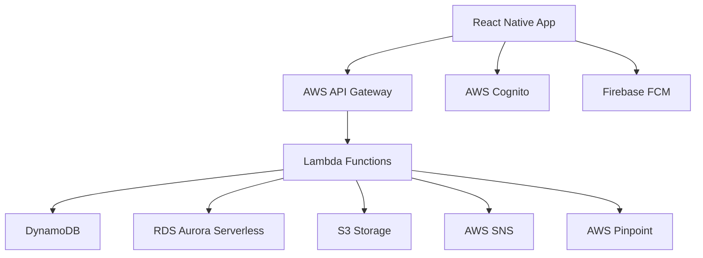

# Application Three - Development Guide

Application Three is a mobile-first application built with React Native and a serverless backend. This guide covers the development workflow, architecture, and best practices for building and maintaining the mobile application ecosystem.

## Architecture Overview

Application Three follows a mobile-first, serverless architecture with cloud-native services and offline-first capabilities.

### Technology Stack
- **Mobile App**: React Native with TypeScript
- **Backend**: AWS Lambda + API Gateway
- **Database**: DynamoDB + RDS Aurora Serverless
- **Authentication**: AWS Cognito
- **Storage**: S3 for file storage
- **Push Notifications**: AWS SNS + Firebase
- **Analytics**: AWS Pinpoint + Custom Analytics

### System Architecture



## Development Environment Setup

### Prerequisites
- Node.js 18+ and npm/yarn
- React Native CLI
- Xcode (for iOS development)
- Android Studio (for Android development)
- AWS CLI configured
- CocoaPods (for iOS dependencies)

### Mobile Development Setup

1. **Clone and setup workspace**
   ```bash
   git clone https://github.com/hallcrest/application-three.git
   cd application-three
   ```

2. **Install dependencies**
   ```bash
   # Install Node dependencies
   npm install
   
   # iOS setup
   cd ios && pod install && cd ..
   
   # Setup environment variables
   cp .env.example .env.local
   # Edit .env.local with your configuration
   ```

3. **Start Metro bundler**
   ```bash
   npm start
   ```

4. **Run on simulators/devices**
   ```bash
   # iOS Simulator
   npm run ios
   
   # Android Emulator
   npm run android
   
   # Physical device
   npm run ios -- --device "Your iPhone"
   npm run android -- --device-id YOUR_DEVICE_ID
   ```

### Backend Development Setup

1. **Setup AWS SAM CLI**
   ```bash
   pip install aws-sam-cli
   sam --version
   ```

2. **Deploy development environment**
   ```bash
   cd backend
   sam build
   sam deploy --guided --stack-name app-three-dev
   ```

3. **Local API development**
   ```bash
   sam local start-api --port 3001
   sam local invoke "UserFunction" --event events/user-create.json
   ```

## Mobile Application Development

### Project Structure
```
src/
├── components/          # Reusable UI components
├── screens/            # Screen components
├── navigation/         # Navigation configuration
├── services/           # API and external services
├── store/              # State management (Redux)
├── utils/              # Utility functions
├── hooks/              # Custom React hooks
├── types/              # TypeScript type definitions
└── constants/          # App constants
```

### Core Components

#### Authentication Component
```typescript
// src/components/AuthComponent.tsx
import React, { useState } from 'react';
import { View, Text, TextInput, TouchableOpacity, Alert } from 'react-native';
import { Auth } from 'aws-amplify';
import { useNavigation } from '@react-navigation/native';

interface AuthComponentProps {
  onAuthSuccess: (user: any) => void;
}

export const AuthComponent: React.FC<AuthComponentProps> = ({ onAuthSuccess }) => {
  const [email, setEmail] = useState('');
  const [password, setPassword] = useState('');
  const [isLoading, setIsLoading] = useState(false);
  const navigation = useNavigation();

  const handleSignIn = async () => {
    try {
      setIsLoading(true);
      const user = await Auth.signIn(email, password);
      onAuthSuccess(user);
      navigation.navigate('Dashboard');
    } catch (error) {
      Alert.alert('Authentication Error', error.message);
    } finally {
      setIsLoading(false);
    }
  };

  const handleSignUp = async () => {
    try {
      setIsLoading(true);
      await Auth.signUp({
        username: email,
        password,
        attributes: { email }
      });
      Alert.alert('Success', 'Please check your email for verification code');
      navigation.navigate('VerifyAccount');
    } catch (error) {
      Alert.alert('Registration Error', error.message);
    } finally {
      setIsLoading(false);
    }
  };

  return (
    <View style={styles.container}>
      <TextInput
        style={styles.input}
        placeholder="Email"
        value={email}
        onChangeText={setEmail}
        keyboardType="email-address"
        autoCapitalize="none"
      />
      <TextInput
        style={styles.input}
        placeholder="Password"
        value={password}
        onChangeText={setPassword}
        secureTextEntry
      />
      <TouchableOpacity 
        style={styles.button} 
        onPress={handleSignIn}
        disabled={isLoading}
      >
        <Text style={styles.buttonText}>Sign In</Text>
      </TouchableOpacity>
      <TouchableOpacity 
        style={[styles.button, styles.secondaryButton]} 
        onPress={handleSignUp}
        disabled={isLoading}
      >
        <Text style={styles.buttonText}>Sign Up</Text>
      </TouchableOpacity>
    </View>
  );
};
```

### State Management with Redux Toolkit

```typescript
// src/store/slices/userSlice.ts
import { createSlice, createAsyncThunk, PayloadAction } from '@reduxjs/toolkit';
import { UserService } from '../services/UserService';

interface User {
  id: string;
  email: string;
  name: string;
  profilePicture?: string;
}

interface UserState {
  currentUser: User | null;
  isLoading: boolean;
  error: string | null;
  isAuthenticated: boolean;
}

const initialState: UserState = {
  currentUser: null,
  isLoading: false,
  error: null,
  isAuthenticated: false,
};

export const fetchUserProfile = createAsyncThunk(
  'user/fetchProfile',
  async (userId: string, { rejectWithValue }) => {
    try {
      const user = await UserService.getProfile(userId);
      return user;
    } catch (error) {
      return rejectWithValue(error.message);
    }
  }
);

export const updateUserProfile = createAsyncThunk(
  'user/updateProfile',
  async (userData: Partial<User>, { rejectWithValue }) => {
    try {
      const updatedUser = await UserService.updateProfile(userData);
      return updatedUser;
    } catch (error) {
      return rejectWithValue(error.message);
    }
  }
);

const userSlice = createSlice({
  name: 'user',
  initialState,
  reducers: {
    setUser: (state, action: PayloadAction<User>) => {
      state.currentUser = action.payload;
      state.isAuthenticated = true;
    },
    clearUser: (state) => {
      state.currentUser = null;
      state.isAuthenticated = false;
    },
    setLoading: (state, action: PayloadAction<boolean>) => {
      state.isLoading = action.payload;
    },
  },
  extraReducers: (builder) => {
    builder
      .addCase(fetchUserProfile.pending, (state) => {
        state.isLoading = true;
        state.error = null;
      })
      .addCase(fetchUserProfile.fulfilled, (state, action) => {
        state.isLoading = false;
        state.currentUser = action.payload;
        state.isAuthenticated = true;
      })
      .addCase(fetchUserProfile.rejected, (state, action) => {
        state.isLoading = false;
        state.error = action.payload as string;
      });
  },
});

export const { setUser, clearUser, setLoading } = userSlice.actions;
export default userSlice.reducer;
```

### API Service Layer

```typescript
// src/services/ApiService.ts
import { Auth } from 'aws-amplify';
import AsyncStorage from '@react-native-async-storage/async-storage';

class ApiService {
  private baseURL: string;
  private timeout: number;

  constructor() {
    this.baseURL = process.env.REACT_APP_API_BASE_URL || 'https://api.app-three.hallcrest.engineering';
    this.timeout = 10000; // 10 seconds
  }

  private async getAuthHeaders(): Promise<Record<string, string>> {
    try {
      const session = await Auth.currentSession();
      const token = session.getIdToken().getJwtToken();
      return {
        'Authorization': `Bearer ${token}`,
        'Content-Type': 'application/json',
      };
    } catch (error) {
      throw new Error('Authentication required');
    }
  }

  private async request<T>(
    endpoint: string,
    options: RequestInit = {}
  ): Promise<T> {
    const url = `${this.baseURL}${endpoint}`;
    const headers = await this.getAuthHeaders();

    const config: RequestInit = {
      ...options,
      headers: {
        ...headers,
        ...options.headers,
      },
      timeout: this.timeout,
    };

    try {
      const response = await fetch(url, config);
      
      if (!response.ok) {
        throw new Error(`HTTP ${response.status}: ${response.statusText}`);
      }

      return await response.json();
    } catch (error) {
      console.error('API Request failed:', error);
      throw error;
    }
  }

  async get<T>(endpoint: string): Promise<T> {
    return this.request<T>(endpoint, { method: 'GET' });
  }

  async post<T>(endpoint: string, data: any): Promise<T> {
    return this.request<T>(endpoint, {
      method: 'POST',
      body: JSON.stringify(data),
    });
  }

  async put<T>(endpoint: string, data: any): Promise<T> {
    return this.request<T>(endpoint, {
      method: 'PUT',
      body: JSON.stringify(data),
    });
  }

  async delete<T>(endpoint: string): Promise<T> {
    return this.request<T>(endpoint, { method: 'DELETE' });
  }
}

export default new ApiService();
```

## Backend Development (AWS Lambda)

### Lambda Function Structure

```typescript
// backend/src/functions/user/handler.ts
import { APIGatewayProxyEvent, APIGatewayProxyResult } from 'aws-lambda';
import { DynamoDBClient } from '@aws-sdk/client-dynamodb';
import { DynamoDBDocumentClient, GetCommand, PutCommand, UpdateCommand } from '@aws-sdk/lib-dynamodb';
import { validateToken } from '../utils/auth';
import { UserService } from '../services/UserService';

const dynamoClient = new DynamoDBClient({ region: process.env.AWS_REGION });
const docClient = DynamoDBDocumentClient.from(dynamoClient);

export const getUser = async (
  event: APIGatewayProxyEvent
): Promise<APIGatewayProxyResult> => {
  try {
    // Validate authentication
    const user = await validateToken(event.headers.Authorization);
    
    const userId = event.pathParameters?.id;
    if (!userId) {
      return {
        statusCode: 400,
        body: JSON.stringify({ error: 'User ID required' }),
      };
    }

    // Check if user can access this profile
    if (user.sub !== userId && !user.isAdmin) {
      return {
        statusCode: 403,
        body: JSON.stringify({ error: 'Access denied' }),
      };
    }

    const userProfile = await UserService.getProfile(userId);
    
    return {
      statusCode: 200,
      headers: {
        'Content-Type': 'application/json',
        'Access-Control-Allow-Origin': '*',
      },
      body: JSON.stringify(userProfile),
    };
  } catch (error) {
    console.error('Error getting user:', error);
    return {
      statusCode: 500,
      body: JSON.stringify({ error: 'Internal server error' }),
    };
  }
};

export const updateUser = async (
  event: APIGatewayProxyEvent
): Promise<APIGatewayProxyResult> => {
  try {
    const user = await validateToken(event.headers.Authorization);
    const userId = event.pathParameters?.id;
    
    if (!userId || user.sub !== userId) {
      return {
        statusCode: 403,
        body: JSON.stringify({ error: 'Access denied' }),
      };
    }

    const updateData = JSON.parse(event.body || '{}');
    const updatedUser = await UserService.updateProfile(userId, updateData);
    
    return {
      statusCode: 200,
      headers: {
        'Content-Type': 'application/json',
        'Access-Control-Allow-Origin': '*',
      },
      body: JSON.stringify(updatedUser),
    };
  } catch (error) {
    console.error('Error updating user:', error);
    return {
      statusCode: 500,
      body: JSON.stringify({ error: 'Internal server error' }),
    };
  }
};
```

### DynamoDB Data Access Layer

```typescript
// backend/src/services/UserService.ts
import { DynamoDBDocumentClient, GetCommand, PutCommand, UpdateCommand, ScanCommand } from '@aws-sdk/lib-dynamodb';
import { v4 as uuidv4 } from 'uuid';

export class UserService {
  constructor(private docClient: DynamoDBDocumentClient) {}

  async getProfile(userId: string) {
    const command = new GetCommand({
      TableName: process.env.USERS_TABLE,
      Key: { userId },
    });

    const result = await this.docClient.send(command);
    
    if (!result.Item) {
      throw new Error('User not found');
    }

    return result.Item;
  }

  async createProfile(userData: any) {
    const userId = uuidv4();
    const now = new Date().toISOString();

    const user = {
      userId,
      ...userData,
      createdAt: now,
      updatedAt: now,
    };

    const command = new PutCommand({
      TableName: process.env.USERS_TABLE,
      Item: user,
    });

    await this.docClient.send(command);
    return user;
  }

  async updateProfile(userId: string, updateData: any) {
    const now = new Date().toISOString();
    
    // Build update expression dynamically
    const updateExpression = [];
    const expressionAttributeNames = {};
    const expressionAttributeValues = {};

    Object.keys(updateData).forEach(key => {
      if (key !== 'userId') {
        updateExpression.push(`#${key} = :${key}`);
        expressionAttributeNames[`#${key}`] = key;
        expressionAttributeValues[`:${key}`] = updateData[key];
      }
    });

    updateExpression.push('#updatedAt = :updatedAt');
    expressionAttributeNames['#updatedAt'] = 'updatedAt';
    expressionAttributeValues[':updatedAt'] = now;

    const command = new UpdateCommand({
      TableName: process.env.USERS_TABLE,
      Key: { userId },
      UpdateExpression: `SET ${updateExpression.join(', ')}`,
      ExpressionAttributeNames: expressionAttributeNames,
      ExpressionAttributeValues: expressionAttributeValues,
      ReturnValues: 'ALL_NEW',
    });

    const result = await this.docClient.send(command);
    return result.Attributes;
  }

  async searchUsers(query: string, limit: number = 20) {
    const command = new ScanCommand({
      TableName: process.env.USERS_TABLE,
      FilterExpression: 'contains(#name, :query) OR contains(#email, :query)',
      ExpressionAttributeNames: {
        '#name': 'name',
        '#email': 'email',
      },
      ExpressionAttributeValues: {
        ':query': query,
      },
      Limit: limit,
    });

    const result = await this.docClient.send(command);
    return result.Items || [];
  }
}
```

### Infrastructure as Code (SAM Template)

```yaml
# backend/template.yaml
AWSTemplateFormatVersion: '2010-09-09'
Transform: AWS::Serverless-2016-10-31
Description: Application Three Backend

Globals:
  Function:
    Timeout: 30
    Runtime: nodejs18.x
    Environment:
      Variables:
        USERS_TABLE: !Ref UsersTable
        FILES_BUCKET: !Ref FilesBucket
        REGION: !Ref AWS::Region

Resources:
  # API Gateway
  ApiGateway:
    Type: AWS::Serverless::Api
    Properties:
      StageName: !Ref Environment
      Cors:
        AllowMethods: "'GET,POST,PUT,DELETE,OPTIONS'"
        AllowHeaders: "'Content-Type,X-Amz-Date,Authorization,X-Api-Key,X-Amz-Security-Token'"
        AllowOrigin: "'*'"
      Auth:
        DefaultAuthorizer: CognitoAuthorizer
        Authorizers:
          CognitoAuthorizer:
            UserPoolArn: !GetAtt UserPool.Arn

  # Lambda Functions
  UserFunction:
    Type: AWS::Serverless::Function
    Properties:
      CodeUri: dist/functions/user/
      Handler: handler.getUser
      Events:
        GetUser:
          Type: Api
          Properties:
            RestApiId: !Ref ApiGateway
            Path: /users/{id}
            Method: get
        UpdateUser:
          Type: Api
          Properties:
            RestApiId: !Ref ApiGateway
            Path: /users/{id}
            Method: put
      Policies:
        - DynamoDBCrudPolicy:
            TableName: !Ref UsersTable

  # DynamoDB Tables
  UsersTable:
    Type: AWS::DynamoDB::Table
    Properties:
      TableName: !Sub "${AWS::StackName}-users"
      BillingMode: PAY_PER_REQUEST
      AttributeDefinitions:
        - AttributeName: userId
          AttributeType: S
      KeySchema:
        - AttributeName: userId
          KeyType: HASH
      StreamSpecification:
        StreamViewType: NEW_AND_OLD_IMAGES

  # S3 Bucket for file storage
  FilesBucket:
    Type: AWS::S3::Bucket
    Properties:
      BucketName: !Sub "${AWS::StackName}-files"
      CorsConfiguration:
        CorsRules:
          - AllowedHeaders: ['*']
            AllowedMethods: [GET, PUT, POST, DELETE]
            AllowedOrigins: ['*']
            MaxAge: 3600

  # Cognito User Pool
  UserPool:
    Type: AWS::Cognito::UserPool
    Properties:
      UserPoolName: !Sub "${AWS::StackName}-users"
      AliasAttributes:
        - email
      AutoVerifiedAttributes:
        - email
      Policies:
        PasswordPolicy:
          MinimumLength: 8
          RequireUppercase: true
          RequireLowercase: true
          RequireNumbers: true
          RequireSymbols: false

  UserPoolClient:
    Type: AWS::Cognito::UserPoolClient
    Properties:
      UserPoolId: !Ref UserPool
      ExplicitAuthFlows:
        - ADMIN_NO_SRP_AUTH
        - USER_PASSWORD_AUTH
        - ALLOW_REFRESH_TOKEN_AUTH

Parameters:
  Environment:
    Type: String
    Default: dev
    AllowedValues: [dev, staging, prod]

Outputs:
  ApiGatewayUrl:
    Description: API Gateway endpoint URL
    Value: !Sub "https://${ApiGateway}.execute-api.${AWS::Region}.amazonaws.com/${Environment}"
    Export:
      Name: !Sub "${AWS::StackName}-api-url"

  UserPoolId:
    Description: Cognito User Pool ID
    Value: !Ref UserPool
    Export:
      Name: !Sub "${AWS::StackName}-user-pool-id"

  UserPoolClientId:
    Description: Cognito User Pool Client ID
    Value: !Ref UserPoolClient
    Export:
      Name: !Sub "${AWS::StackName}-user-pool-client-id"
```

## Testing Strategy

### Unit Testing for React Native

```typescript
// src/components/__tests__/AuthComponent.test.tsx
import React from 'react';
import { render, fireEvent, waitFor } from '@testing-library/react-native';
import { Auth } from 'aws-amplify';
import { AuthComponent } from '../AuthComponent';

jest.mock('aws-amplify');
jest.mock('@react-navigation/native');

const mockAuth = Auth as jest.Mocked<typeof Auth>;

describe('AuthComponent', () => {
  const mockOnAuthSuccess = jest.fn();

  beforeEach(() => {
    jest.clearAllMocks();
  });

  it('should handle successful sign in', async () => {
    const mockUser = { username: 'test@example.com' };
    mockAuth.signIn.mockResolvedValue(mockUser);

    const { getByPlaceholderText, getByText } = render(
      <AuthComponent onAuthSuccess={mockOnAuthSuccess} />
    );

    fireEvent.changeText(getByPlaceholderText('Email'), 'test@example.com');
    fireEvent.changeText(getByPlaceholderText('Password'), 'password123');
    fireEvent.press(getByText('Sign In'));

    await waitFor(() => {
      expect(mockAuth.signIn).toHaveBeenCalledWith('test@example.com', 'password123');
      expect(mockOnAuthSuccess).toHaveBeenCalledWith(mockUser);
    });
  });

  it('should handle sign in error', async () => {
    mockAuth.signIn.mockRejectedValue(new Error('Invalid credentials'));

    const { getByPlaceholderText, getByText } = render(
      <AuthComponent onAuthSuccess={mockOnAuthSuccess} />
    );

    fireEvent.changeText(getByPlaceholderText('Email'), 'test@example.com');
    fireEvent.changeText(getByPlaceholderText('Password'), 'wrongpassword');
    fireEvent.press(getByText('Sign In'));

    await waitFor(() => {
      expect(mockAuth.signIn).toHaveBeenCalled();
      expect(mockOnAuthSuccess).not.toHaveBeenCalled();
    });
  });
});
```

### Integration Testing for Lambda Functions

```typescript
// backend/src/functions/__tests__/user.test.ts
import { APIGatewayProxyEvent } from 'aws-lambda';
import { getUser, updateUser } from '../user/handler';
import { UserService } from '../services/UserService';

jest.mock('../services/UserService');
jest.mock('../utils/auth');

const mockUserService = UserService as jest.Mocked<typeof UserService>;

describe('User Lambda Functions', () => {
  const mockEvent: Partial<APIGatewayProxyEvent> = {
    headers: {
      Authorization: 'Bearer valid-token',
    },
    pathParameters: {
      id: 'user-123',
    },
  };

  beforeEach(() => {
    jest.clearAllMocks();
  });

  describe('getUser', () => {
    it('should return user profile', async () => {
      const mockUser = {
        userId: 'user-123',
        email: 'test@example.com',
        name: 'Test User',
      };

      mockUserService.getProfile.mockResolvedValue(mockUser);

      const result = await getUser(mockEvent as APIGatewayProxyEvent);

      expect(result.statusCode).toBe(200);
      expect(JSON.parse(result.body)).toEqual(mockUser);
    });

    it('should return 404 for non-existent user', async () => {
      mockUserService.getProfile.mockRejectedValue(new Error('User not found'));

      const result = await getUser(mockEvent as APIGatewayProxyEvent);

      expect(result.statusCode).toBe(500);
    });
  });
});
```

### End-to-End Testing with Detox

```typescript
// e2e/app.e2e.ts
import { device, expect, element, by } from 'detox';

describe('Application Three E2E', () => {
  beforeAll(async () => {
    await device.launchApp();
  });

  beforeEach(async () => {
    await device.reloadReactNative();
  });

  it('should allow user to sign in', async () => {
    await element(by.id('email-input')).typeText('test@example.com');
    await element(by.id('password-input')).typeText('password123');
    await element(by.id('sign-in-button')).tap();

    await expect(element(by.id('dashboard-screen'))).toBeVisible();
  });

  it('should navigate to profile screen', async () => {
    // Assume user is already signed in
    await element(by.id('profile-tab')).tap();
    await expect(element(by.id('profile-screen'))).toBeVisible();
  });

  it('should upload and display profile picture', async () => {
    await element(by.id('profile-tab')).tap();
    await element(by.id('upload-photo-button')).tap();
    await element(by.text('Camera')).tap();
    
    // Wait for camera permission and photo capture
    await expect(element(by.id('profile-image'))).toBeVisible();
  });
});
```

## Performance Optimization

### React Native Performance

```typescript
// src/hooks/useOptimizedImage.ts
import { useState, useEffect } from 'react';
import { Image } from 'react-native';
import FastImage from 'react-native-fast-image';

interface UseOptimizedImageProps {
  uri: string;
  placeholder?: string;
  quality?: 'low' | 'medium' | 'high';
}

export const useOptimizedImage = ({
  uri,
  placeholder,
  quality = 'medium'
}: UseOptimizedImageProps) => {
  const [imageUri, setImageUri] = useState(placeholder);
  const [isLoading, setIsLoading] = useState(true);
  const [hasError, setHasError] = useState(false);

  useEffect(() => {
    if (!uri) return;

    // Preload image
    const preload = () => {
      FastImage.preload([{
        uri,
        priority: quality === 'high' ? FastImage.priority.high : FastImage.priority.normal,
      }]);
    };

    preload();

    // Set up image loading handlers
    const handleLoad = () => {
      setImageUri(uri);
      setIsLoading(false);
      setHasError(false);
    };

    const handleError = () => {
      setIsLoading(false);
      setHasError(true);
    };

    // Create image instance to detect load/error
    const image = new Image();
    image.onload = handleLoad;
    image.onerror = handleError;
    image.src = uri;

    return () => {
      image.onload = null;
      image.onerror = null;
    };
  }, [uri, quality]);

  return { imageUri, isLoading, hasError };
};
```

### Lambda Cold Start Optimization

```typescript
// backend/src/utils/warmup.ts
import { APIGatewayProxyEvent, APIGatewayProxyResult } from 'aws-lambda';

// Keep connections warm
let isWarm = false;
const connections = new Map();

export const warmupHandler = async (): Promise<APIGatewayProxyResult> => {
  if (!isWarm) {
    // Initialize connections
    await initializeConnections();
    isWarm = true;
  }

  return {
    statusCode: 200,
    body: JSON.stringify({ message: 'Function is warm' }),
  };
};

export const withWarmup = (handler: Function) => {
  return async (event: APIGatewayProxyEvent, context: any) => {
    // Check if this is a warmup request
    if (event.source === 'aws.events' && event['detail-type'] === 'Scheduled Event') {
      return warmupHandler();
    }

    // Ensure function is warm
    if (!isWarm) {
      await initializeConnections();
      isWarm = true;
    }

    return handler(event, context);
  };
};

async function initializeConnections() {
  // Initialize database connections, external service clients, etc.
  // This runs once per container lifecycle
}
```

## Security Best Practices

### Mobile App Security

```typescript
// src/utils/security.ts
import CryptoJS from 'crypto-js';
import DeviceInfo from 'react-native-device-info';
import { MMKV } from 'react-native-mmkv';

class SecurityManager {
  private storage = new MMKV();
  private encryptionKey: string;

  constructor() {
    this.encryptionKey = this.generateEncryptionKey();
  }

  private generateEncryptionKey(): string {
    // Generate device-specific encryption key
    const deviceId = DeviceInfo.getUniqueId();
    return CryptoJS.SHA256(deviceId + 'app-secret-salt').toString();
  }

  encryptData(data: string): string {
    return CryptoJS.AES.encrypt(data, this.encryptionKey).toString();
  }

  decryptData(encryptedData: string): string {
    const bytes = CryptoJS.AES.decrypt(encryptedData, this.encryptionKey);
    return bytes.toString(CryptoJS.enc.Utf8);
  }

  secureStore(key: string, value: string): void {
    const encrypted = this.encryptData(value);
    this.storage.set(key, encrypted);
  }

  secureRetrieve(key: string): string | null {
    const encrypted = this.storage.getString(key);
    if (!encrypted) return null;
    
    try {
      return this.decryptData(encrypted);
    } catch (error) {
      console.error('Failed to decrypt data:', error);
      return null;
    }
  }

  clearSecureData(): void {
    this.storage.clearAll();
  }

  validateCertificatePinning(serverCertificate: string): boolean {
    const expectedFingerprint = 'SHA256:EXPECTED_CERTIFICATE_FINGERPRINT';
    const actualFingerprint = CryptoJS.SHA256(serverCertificate).toString();
    return actualFingerprint === expectedFingerprint;
  }
}

export default new SecurityManager();
```

## Deployment and Distribution

### iOS App Store Deployment

```bash
#!/bin/bash
# scripts/deploy-ios.sh

echo "Building iOS app for App Store..."

# Clean and install dependencies
rm -rf node_modules ios/build
npm install
cd ios && pod install && cd ..

# Build for release
npx react-native run-ios --configuration Release --device

# Archive the app
xcodebuild -workspace ios/ApplicationThree.xcworkspace \
           -scheme ApplicationThree \
           -configuration Release \
           -archivePath ios/build/ApplicationThree.xcarchive \
           archive

# Export for App Store
xcodebuild -exportArchive \
           -archivePath ios/build/ApplicationThree.xcarchive \
           -exportPath ios/build/ \
           -exportOptionsPlist ios/ExportOptions.plist

echo "iOS build completed. Check ios/build/ for IPA file."
```

### Android Play Store Deployment

```bash
#!/bin/bash
# scripts/deploy-android.sh

echo "Building Android app for Play Store..."

# Clean and install dependencies
rm -rf node_modules android/app/build
npm install

# Generate signed APK
cd android
./gradlew assembleRelease

# Generate signed Bundle
./gradlew bundleRelease

echo "Android build completed. Check android/app/build/outputs/ for APK/Bundle files."
```

### Backend Deployment Pipeline

```yaml
# .github/workflows/deploy-backend.yml
name: Deploy Backend

on:
  push:
    branches: [main]
    paths: ['backend/**']

jobs:
  deploy:
    runs-on: ubuntu-latest
    steps:
      - uses: actions/checkout@v4
      
      - name: Setup Node.js
        uses: actions/setup-node@v4
        with:
          node-version: '18'
      
      - name: Configure AWS credentials
        uses: aws-actions/configure-aws-credentials@v2
        with:
          aws-access-key-id: ${{ secrets.AWS_ACCESS_KEY_ID }}
          aws-secret-access-key: ${{ secrets.AWS_SECRET_ACCESS_KEY }}
          aws-region: us-east-1
      
      - name: Install dependencies
        run: |
          cd backend
          npm install
      
      - name: Run tests
        run: |
          cd backend
          npm test
      
      - name: Build and deploy
        run: |
          cd backend
          sam build
          sam deploy --no-confirm-changeset --no-fail-on-empty-changeset
```

For comprehensive development support and mobile app development questions, contact the mobile team at mobile-dev@hallcrest.engineering.