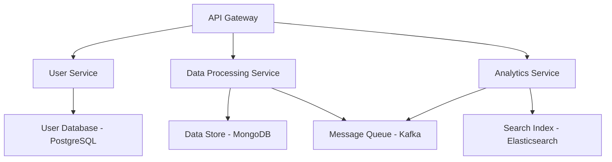
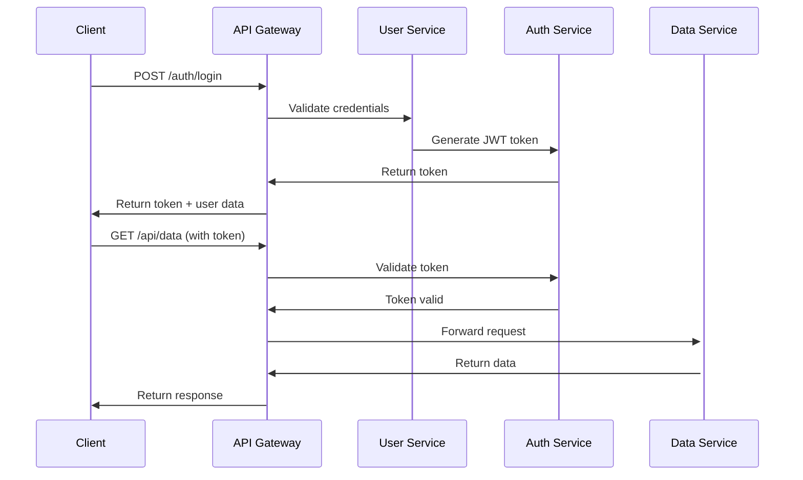

# Application Two - Development Guide

Application Two is a distributed microservices platform designed for high-scale data processing and real-time analytics. This guide covers the development workflow, architecture, and best practices.

## Architecture Overview

Application Two follows a microservices architecture pattern with event-driven communication and containerized deployment.

### Technology Stack
- **Services**: Python FastAPI + Java Spring Boot
- **Message Queue**: Apache Kafka
- **Database**: MongoDB + PostgreSQL
- **Cache**: Redis Cluster
- **Search**: Elasticsearch
- **Monitoring**: Prometheus + Grafana

### Service Map



## Development Environment

### Prerequisites
- Docker Desktop 4.0+
- Python 3.11+ with pip
- Java 17+ with Maven
- Node.js 18+ (for API Gateway)
- kubectl and docker-compose

### Local Setup

1. **Clone and setup workspace**
   ```bash
   git clone https://github.com/hallcrest/application-two.git
   cd application-two
   ./scripts/setup-dev.sh
   ```

2. **Start development environment**
   ```bash
   docker-compose -f docker-compose.dev.yml up -d
   ```

3. **Initialize databases**
   ```bash
   ./scripts/init-databases.sh
   ```

4. **Start services in development mode**
   ```bash
   # Terminal 1 - API Gateway
   cd services/api-gateway && npm run dev
   
   # Terminal 2 - User Service
   cd services/user-service && python -m uvicorn main:app --reload
   
   # Terminal 3 - Data Processing Service
   cd services/data-processor && mvn spring-boot:run
   
   # Terminal 4 - Analytics Service
   cd services/analytics && python -m uvicorn main:app --reload
   ```

## Service Development

### User Service (Python FastAPI)

**API Endpoints:**
```python
# services/user-service/main.py
from fastapi import FastAPI, Depends, HTTPException
from sqlalchemy.orm import Session
from . import models, schemas, crud, database

app = FastAPI(title="User Service", version="2.0.0")

@app.post("/users/", response_model=schemas.User)
def create_user(user: schemas.UserCreate, db: Session = Depends(database.get_db)):
    return crud.create_user(db=db, user=user)

@app.get("/users/{user_id}", response_model=schemas.User)
def read_user(user_id: int, db: Session = Depends(database.get_db)):
    db_user = crud.get_user(db, user_id=user_id)
    if db_user is None:
        raise HTTPException(status_code=404, detail="User not found")
    return db_user

@app.get("/users/", response_model=List[schemas.User])
def read_users(skip: int = 0, limit: int = 100, db: Session = Depends(database.get_db)):
    return crud.get_users(db, skip=skip, limit=limit)
```

### Data Processing Service (Java Spring Boot)

**Message Processing:**
```java
// services/data-processor/src/main/java/com/hallcrest/processor/KafkaConsumer.java
@Component
public class DataProcessor {
    
    @Autowired
    private DataRepository dataRepository;
    
    @KafkaListener(topics = "data-events", groupId = "processor-group")
    public void processDataEvent(String event) {
        try {
            DataEvent dataEvent = objectMapper.readValue(event, DataEvent.class);
            
            // Process the data
            ProcessedData processed = processData(dataEvent);
            
            // Store in MongoDB
            dataRepository.save(processed);
            
            // Send processed event
            kafkaTemplate.send("processed-events", processed.toJson());
            
        } catch (Exception e) {
            log.error("Error processing data event: {}", e.getMessage());
        }
    }
    
    private ProcessedData processData(DataEvent event) {
        return ProcessedData.builder()
            .id(event.getId())
            .processedAt(Instant.now())
            .result(performCalculations(event.getData()))
            .metadata(event.getMetadata())
            .build();
    }
}
```

## API Documentation

### OpenAPI Specifications

Each service provides OpenAPI documentation:
- User Service: http://localhost:8001/docs
- Data Processor: http://localhost:8002/swagger-ui.html
- Analytics Service: http://localhost:8003/docs
- API Gateway: http://localhost:8000/api-docs

### Authentication Flow



## Testing Strategy

### Unit Testing

**Python Services (pytest):**
```python
# tests/test_user_service.py
import pytest
from fastapi.testclient import TestClient
from sqlalchemy import create_engine
from sqlalchemy.orm import sessionmaker

from main import app, get_db
from database import Base

SQLALCHEMY_DATABASE_URL = "sqlite:///./test.db"
engine = create_engine(SQLALCHEMY_DATABASE_URL, connect_args={"check_same_thread": False})
TestingSessionLocal = sessionmaker(autocommit=False, autoflush=False, bind=engine)

def override_get_db():
    try:
        db = TestingSessionLocal()
        yield db
    finally:
        db.close()

app.dependency_overrides[get_db] = override_get_db
client = TestClient(app)

def test_create_user():
    response = client.post(
        "/users/",
        json={"email": "test@example.com", "name": "Test User"}
    )
    assert response.status_code == 200
    data = response.json()
    assert data["email"] == "test@example.com"
    assert "id" in data
```

**Java Services (JUnit 5):**
```java
// services/data-processor/src/test/java/DataProcessorTest.java
@SpringBootTest
@TestPropertySource(locations = "classpath:application-test.properties")
class DataProcessorTest {
    
    @Autowired
    private DataProcessor dataProcessor;
    
    @MockBean
    private DataRepository dataRepository;
    
    @Test
    void shouldProcessDataEvent() {
        // Given
        DataEvent event = DataEvent.builder()
            .id("test-123")
            .data(Map.of("value", 100))
            .build();
        
        // When
        ProcessedData result = dataProcessor.processData(event);
        
        // Then
        assertThat(result.getId()).isEqualTo("test-123");
        assertThat(result.getResult()).isNotNull();
        verify(dataRepository).save(any(ProcessedData.class));
    }
}
```

### Integration Testing

**Service Communication Tests:**
```python
# tests/integration/test_service_communication.py
import pytest
import requests
from testcontainers import DockerCompose

@pytest.fixture(scope="module")
def docker_compose():
    with DockerCompose(".", compose_file_name="docker-compose.test.yml") as compose:
        yield compose

def test_user_creation_flow(docker_compose):
    # Create user via User Service
    response = requests.post(
        "http://localhost:8001/users/",
        json={"email": "integration@test.com", "name": "Integration Test"}
    )
    assert response.status_code == 200
    user_id = response.json()["id"]
    
    # Verify user exists via API Gateway
    response = requests.get(f"http://localhost:8000/api/users/{user_id}")
    assert response.status_code == 200
    assert response.json()["email"] == "integration@test.com"
```

## Database Management

### MongoDB Operations
```python
# services/data-processor/database.py
from motor.motor_asyncio import AsyncIOMotorClient
from pymongo import IndexModel, ASCENDING, DESCENDING

class MongoDB:
    def __init__(self, connection_string: str):
        self.client = AsyncIOMotorClient(connection_string)
        self.database = self.client.application_two
    
    async def create_indexes(self):
        # Create indexes for better query performance
        await self.database.processed_data.create_indexes([
            IndexModel([("processed_at", DESCENDING)]),
            IndexModel([("metadata.type", ASCENDING)]),
            IndexModel([("result.category", ASCENDING), ("processed_at", DESCENDING)])
        ])
    
    async def find_recent_data(self, limit: int = 100):
        cursor = self.database.processed_data.find(
            {},
            sort=[("processed_at", -1)],
            limit=limit
        )
        return await cursor.to_list(length=limit)
```

### PostgreSQL Migrations
```sql
-- migrations/V001__create_users_table.sql
CREATE TABLE users (
    id SERIAL PRIMARY KEY,
    email VARCHAR(255) UNIQUE NOT NULL,
    name VARCHAR(255) NOT NULL,
    is_active BOOLEAN DEFAULT true,
    created_at TIMESTAMP DEFAULT CURRENT_TIMESTAMP,
    updated_at TIMESTAMP DEFAULT CURRENT_TIMESTAMP
);

CREATE INDEX idx_users_email ON users(email);
CREATE INDEX idx_users_created_at ON users(created_at);

-- migrations/V002__create_user_preferences.sql
CREATE TABLE user_preferences (
    id SERIAL PRIMARY KEY,
    user_id INTEGER REFERENCES users(id) ON DELETE CASCADE,
    preferences JSONB DEFAULT '{}',
    created_at TIMESTAMP DEFAULT CURRENT_TIMESTAMP,
    updated_at TIMESTAMP DEFAULT CURRENT_TIMESTAMP
);

CREATE INDEX idx_user_preferences_user_id ON user_preferences(user_id);
```

## Event-Driven Architecture

### Kafka Message Schemas

```json
{
  "schemas": {
    "DataEvent": {
      "type": "object",
      "properties": {
        "id": {"type": "string"},
        "timestamp": {"type": "string", "format": "date-time"},
        "data": {"type": "object"},
        "metadata": {
          "type": "object",
          "properties": {
            "source": {"type": "string"},
            "type": {"type": "string"},
            "version": {"type": "string"}
          }
        }
      },
      "required": ["id", "timestamp", "data", "metadata"]
    }
  }
}
```

### Event Handling Patterns

```python
# services/analytics/event_handlers.py
from abc import ABC, abstractmethod
from typing import Dict, Any

class EventHandler(ABC):
    @abstractmethod
    async def handle(self, event: Dict[str, Any]) -> None:
        pass

class DataAnalyticsHandler(EventHandler):
    async def handle(self, event: Dict[str, Any]) -> None:
        # Extract data for analytics
        data = event.get("data", {})
        
        # Perform real-time analytics
        metrics = await self.calculate_metrics(data)
        
        # Update Elasticsearch index
        await self.update_search_index(event["id"], metrics)
        
        # Store in analytics database
        await self.store_analytics(metrics)

class EventProcessor:
    def __init__(self):
        self.handlers = {
            "data.processed": DataAnalyticsHandler(),
            "user.created": UserAnalyticsHandler(),
            "system.alert": AlertHandler()
        }
    
    async def process_event(self, event_type: str, event_data: Dict[str, Any]):
        handler = self.handlers.get(event_type)
        if handler:
            await handler.handle(event_data)
        else:
            logger.warning(f"No handler found for event type: {event_type}")
```

## Performance Optimization

### Caching Strategy
```python
# services/common/cache.py
import redis
import json
from typing import Optional, Any

class CacheManager:
    def __init__(self, redis_url: str):
        self.redis = redis.from_url(redis_url)
    
    async def get(self, key: str) -> Optional[Any]:
        value = await self.redis.get(key)
        return json.loads(value) if value else None
    
    async def set(self, key: str, value: Any, ttl: int = 3600):
        await self.redis.setex(key, ttl, json.dumps(value))
    
    async def delete(self, key: str):
        await self.redis.delete(key)
    
    def cache_result(self, ttl: int = 3600):
        def decorator(func):
            async def wrapper(*args, **kwargs):
                cache_key = f"{func.__name__}:{hash(str(args) + str(kwargs))}"
                
                # Try to get from cache
                cached_result = await self.get(cache_key)
                if cached_result is not None:
                    return cached_result
                
                # Execute function and cache result
                result = await func(*args, **kwargs)
                await self.set(cache_key, result, ttl)
                return result
            
            return wrapper
        return decorator
```

## Deployment

### Docker Configuration

```dockerfile
# services/user-service/Dockerfile
FROM python:3.11-slim

WORKDIR /app

# Install system dependencies
RUN apt-get update && apt-get install -y \
    gcc \
    && rm -rf /var/lib/apt/lists/*

# Install Python dependencies
COPY requirements.txt .
RUN pip install --no-cache-dir -r requirements.txt

# Copy application code
COPY . .

# Create non-root user
RUN useradd -m -u 1000 appuser && chown -R appuser:appuser /app
USER appuser

# Health check
HEALTHCHECK --interval=30s --timeout=10s --start-period=5s --retries=3 \
    CMD curl -f http://localhost:8000/health || exit 1

EXPOSE 8000

CMD ["uvicorn", "main:app", "--host", "0.0.0.0", "--port", "8000"]
```

### Kubernetes Manifests

```yaml
# k8s/user-service.yaml
apiVersion: apps/v1
kind: Deployment
metadata:
  name: user-service
  namespace: application-two
spec:
  replicas: 3
  selector:
    matchLabels:
      app: user-service
  template:
    metadata:
      labels:
        app: user-service
    spec:
      containers:
      - name: user-service
        image: ghcr.io/hallcrest/user-service:latest
        ports:
        - containerPort: 8000
        env:
        - name: DATABASE_URL
          valueFrom:
            secretKeyRef:
              name: app-secrets
              key: database-url
        - name: REDIS_URL
          valueFrom:
            secretKeyRef:
              name: app-secrets
              key: redis-url
        resources:
          requests:
            memory: "256Mi"
            cpu: "250m"
          limits:
            memory: "512Mi"
            cpu: "500m"
        livenessProbe:
          httpGet:
            path: /health
            port: 8000
          initialDelaySeconds: 30
          periodSeconds: 10
        readinessProbe:
          httpGet:
            path: /ready
            port: 8000
          initialDelaySeconds: 5
          periodSeconds: 5
```

## Security

### Authentication & Authorization

```python
# services/common/security.py
from fastapi import HTTPException, Depends, status
from fastapi.security import HTTPBearer, HTTPAuthorizationCredentials
import jwt
from datetime import datetime, timedelta

security = HTTPBearer()

class AuthManager:
    def __init__(self, secret_key: str):
        self.secret_key = secret_key
        self.algorithm = "HS256"
    
    def create_access_token(self, data: dict):
        to_encode = data.copy()
        expire = datetime.utcnow() + timedelta(hours=24)
        to_encode.update({"exp": expire})
        return jwt.encode(to_encode, self.secret_key, algorithm=self.algorithm)
    
    def verify_token(self, token: str):
        try:
            payload = jwt.decode(token, self.secret_key, algorithms=[self.algorithm])
            return payload
        except jwt.ExpiredSignatureError:
            raise HTTPException(
                status_code=status.HTTP_401_UNAUTHORIZED,
                detail="Token expired"
            )
        except jwt.JWTError:
            raise HTTPException(
                status_code=status.HTTP_401_UNAUTHORIZED,
                detail="Invalid token"
            )

def get_current_user(credentials: HTTPAuthorizationCredentials = Depends(security)):
    auth_manager = AuthManager(settings.SECRET_KEY)
    payload = auth_manager.verify_token(credentials.credentials)
    return payload
```

## Best Practices

### Code Quality Standards
- **Python**: Black formatting, flake8 linting, mypy type checking
- **Java**: Checkstyle, SpotBugs, PMD analysis
- **API Design**: RESTful principles, OpenAPI documentation
- **Error Handling**: Structured logging, proper error responses

### Development Workflow
1. Feature branch development
2. Automated testing on pull requests
3. Code review requirements
4. Integration testing before merge
5. Automated deployment to staging
6. Manual approval for production

For additional development resources and support, contact the development team at dev-team@hallcrest.engineering.